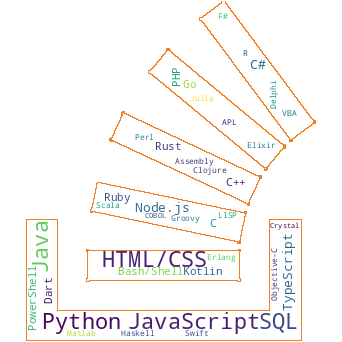
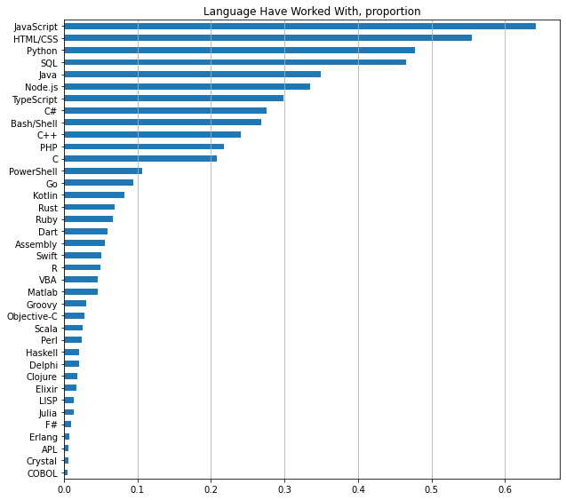
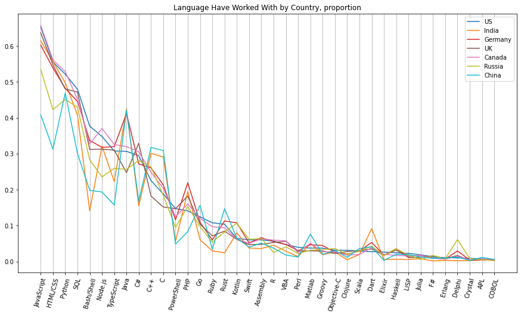
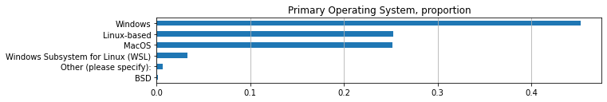
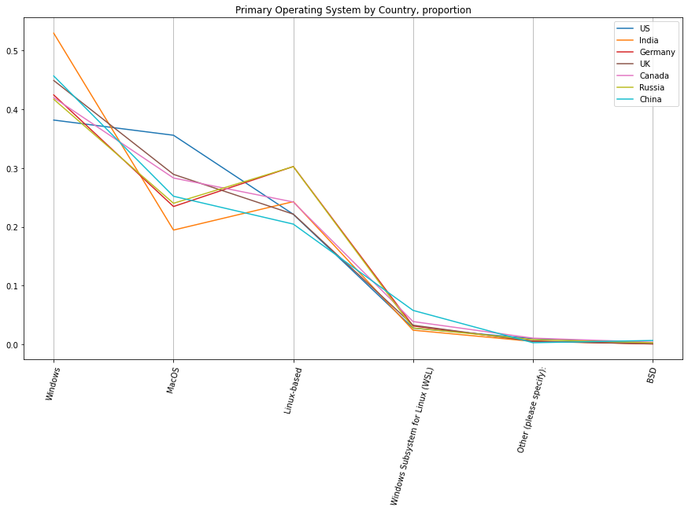
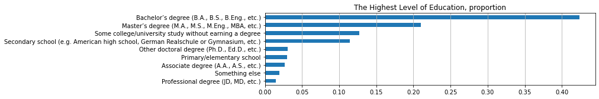
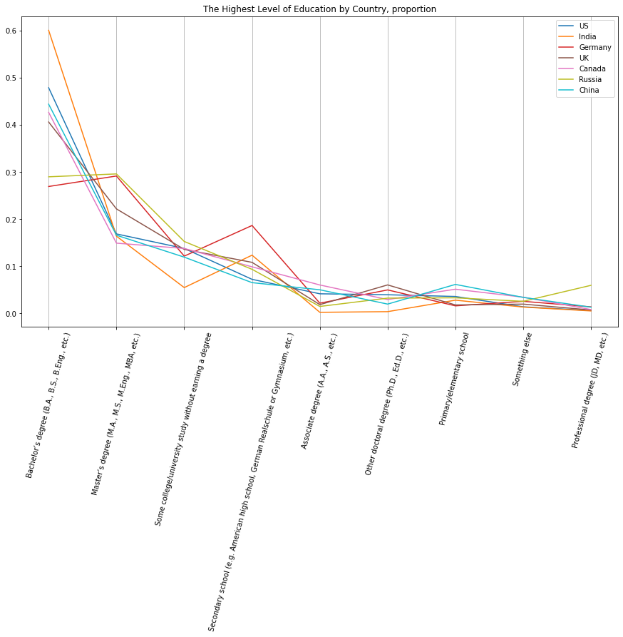
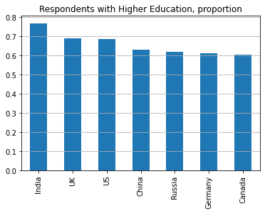

 

  

Every year since 2011 Stack Overflow conducts a survey of its users. In 2021 over 80,000 users from over 180 countries shared what technology they use or want to learn, how they learn or solve their problems, their employment status, salary, etc.

The annual data is published on the Stack Overflow website ([https://insights.stackoverflow.com/survey](https://insights.stackoverflow.com/survey)).

I decided to look at 2021 Stack Overflow Annual Developer Survey and try to answer following questions:

1. What programming languages were used the most among all respondents and in different countries?
2. What operating systems were used the most among all respondents and in different countries?
3. What highest level of education do respondents have? What about some specific countries?

## What programming languages were used the most among all respondents and in different countries?

The results are somewhat expected.

JavaScript, HTML/CSS, Python and SQL were used the most. JavaScript is the clear leader with about 65% of users. These results suggest that web development is still in trend.

I also want to see if the distribution is different in some countries.
Here is the top 6 most represented countries in the survey.

| Country | Number of users |
| --------------------------- | ------------------------ |
| United States of America | 15288 |
| India | 10511  |
| Germany | 5625  |
| United Kingdom of Great Britain and Northern Ireland| 4475  |
| Canada | 3012  |

I want to compare those 6 countries and 2 other big ones: Russia and China.

This plot reveals us very interesting insights.  
Compared to other countries:
- Python is more popular than HTML/CSS in Russia and China. In fact, in China it is even more popular than JavaScript.
- Java is very popular in India, Germany and China.
- Only in the US PHP is less popular than PowerShell.
- Old Delphi is still widely used in Russia.
- India has a noticeable low use of Bash/Shell, Go, Rust.
- At the same time, Dart is very popular in India.

## What operating systems were used the most among all respondents and in different countries?

Now let's look what operating systems were used.

Windows is by far the leading operating system with close to half of users. Next, Linux-based and MacOS are used by about the same amount of respondents.

Is it going to look the same way by country?

Here we also got some interesting results.  
Compared to other countries:
- In the US proportion of MacOS users is actually very close to proportion of Windows users. And among those 7 countries, US has the smallest proportion of Windows users and the biggest proportion of MacOS users.
- As opposed to US, India has the biggest proportion of Windows users and the smallest proportion of MacOS users.
- Russia and Germany have almost identical distributions.
- Linux-based OS is more popular than MacOS only in Russia, Germany and India.

## What highest level of education do respondents have? What about some specific countries?

Let's look at the level of formal education.

Almost half of the respondents have Bachelor's degree. Next big group, just a little over 20%, have Master's degree.

Compared to other countries:
- India has by far highest proportion of respondents with Bachelor's degree.
- Doctoral degree is more popular in UK.
- Germany and Russia have the highest proportion of respondents with Master's degree.

I want to compare the total proportion of higher education (Bachelor's degree, Master's degree, and doctoral degree together).

India is leading by proportion of respondents with higher education.  
UK and US go next, almost 1% behind.

## Conclusion

As we see, the average, whole world, trends not necessary go the same way, as in specific countries. Sometimes the difference is significant.
